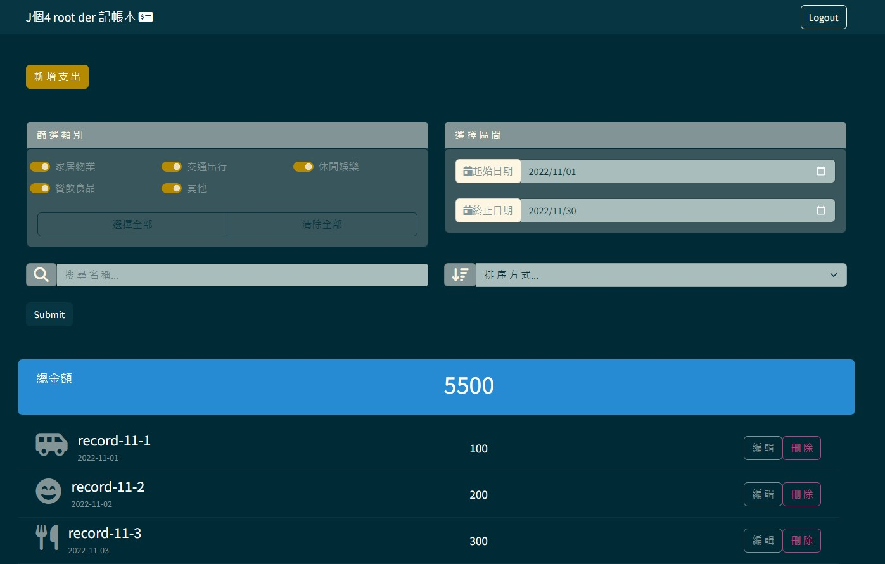

# 記帳軟體



## 介紹

記錄自己的每日支出，提高對於金錢的掌握度!

[Heroku App](https://calm-wildwood-13496.herokuapp.com/)

email: root@example.com

password: 12345678

### 功能

- 首頁查看所有紀錄
- 新增紀錄
- 刪除紀錄
- 編輯紀錄
- 篩選類別
- 篩選日期
- 查詢紀錄名稱
- 按照金額or日期排序

### 帳號
create an account with your email, Facebook or Google

## 開始使用

### Setup MongoDB
1. Turn on the DB
```
[~] $ cd ~/mongodb/bin/
[~/mongodb/bin] $ ./mongod --dbpath ~/mongodb-data
```
2. Create a database named "expense-tracker"
```
add expense-tracker
```
### Activate Project
1. Clone this git to local
```
[~] $ git clone https://github.com/Johnny77585/expense-tracker.git
```

2. Get into the directory
```
[~] $ cd expense-tracker
```

3. Install packages
```
[~/expense-tracker] $ npm install
```

4. Run the project
```
[~/expense-tracker] $ npm run seed
[~/expense-tracker] $ npm run start
```
## 開發工具

- Node.js 
- Express
- MongoDB
- mongoose 